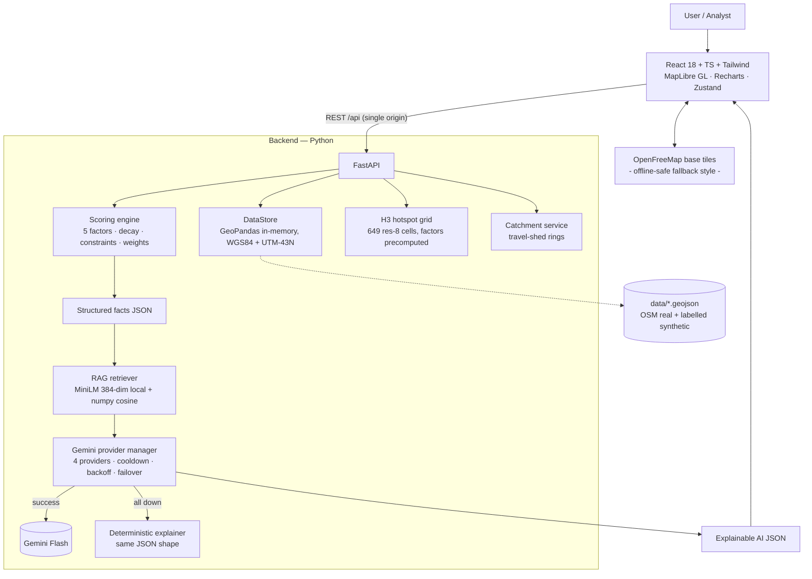

# GeoReady-AI — Architecture

> Core principle (PS-2 Rule 1): **the geospatial engine computes; the LLM explains.**
> Deterministic core, AI on the edges, graceful degradation everywhere.

## System diagram



## Layered flow

```
DATA (real OSM + synthetic, labelled & replaceable)
  → INGESTION (scripts/generate_data.py · fetch_osm.py — safe, never destroys good data)
  → In-memory spatial store (GeoPandas, WGS84 + UTM-43N projections, vectorised arrays)
  → SPATIAL ANALYSIS (distances, densities, containment — Shapely 2 ufuncs)
  → SCORING ENGINE (normalize 0-100 → constraints → weighted sum → status → reasons)
  → API (FastAPI, validated with pydantic)
  → UI (map · panels · charts)
  → AI EXPLANATION (RAG context + Gemini failover + deterministic fallback)
```

## Backend modules

| Module | Responsibility | PS-2 anchor |
|---|---|---|
| `geospatial/loader.py` | loads 8 GeoJSON layers once; WGS84+UTM frames; numpy/shapely fast arrays; user-site persistence | §21, §33 |
| `scoring/factors.py` | the five factor scorers with documented decay constants | §13–§17, §29–§32 |
| `scoring/engine.py` | weight validation, hard constraints, status bands, reasons/risks, LLM fact-pack | §27–§31 |
| `geospatial/hexgrid.py` | per-cell factor precompute; per-request weighted render; distributions | §33–§34 |
| `rag/knowledge.py` + `rag/store.py` | 17-chunk knowledge corpus; local MiniLM embeddings; cosine top-K; lexical fallback | §3–§8 |
| `ai/provider.py` | Gemini REST client ×4; error classification (429 → cooldown, 4xx → disable); failover chain | §10–§13 |
| `ai/explainer.py` | rule-based explainer — identical JSON contract as the LLM | §53–§54 |
| `ai/cache.py` | TTL cache keyed by facts+weights+methodology/prompt version | §8, §55 |

## Hotspot precompute — why the heatmap is instant

At startup we compute the **business-independent** raw factor values for every H3 res-8 cell
centroid (population, accessibility, competition-avoid form, land category, environment).
A request only applies the per-business land-use mapping + competition polarity + weight sum →
sub-100 ms for 649 cells, cache-friendly, fully reproducible.

## Frontend composition

```
pages/MapAnalysis.tsx          ← the star: map + sidebars + analysis panel + compare tray
components/Map/MapView.tsx     ← MapLibre engine: style failover, 8+3 data sources, clicks, popups
components/Sidebar/*           ← business select · weight sliders · layer/opacity · candidates
components/Analysis/*          ← gauge · factor bars · AI block · catchment · report actions
pages/Dashboard|Compare|Analytics
```

- **HashRouter** — deep links work on any static host / sandboxed preview.
- **Single-origin prod mode** — FastAPI serves `frontend/dist`; Vite proxy only in dev.
- **Basemap failover** — OpenFreeMap dark → liberty → bundled offline style. The badge top-left
  shows which mode is live. Demo Wi-Fi can die; the demo can't.

## Failure-mode matrix

| Failure | Behaviour |
|---|---|
| No Gemini keys configured | deterministic explainer is primary (same JSON) |
| Gemini A rate-limited (429) | cooldown 30s·2ⁿ → provider B → C → D |
| All providers down | deterministic explainer + honest `fallback_reason` badge |
| Embedding model can't load | lexical RAG (token overlap) — flagged in `rag_mode` |
| Venue Wi-Fi dies | offline-safe basemap + local fonts; all data layers are local |
| Overpass rate-limited (data build) | previous real data kept; synthetic fallback only if none exists |

## Approved deviations from the PS-2 stack doc

| Doc says | We ship (24-h) | Upgrade path |
|---|---|---|
| PostGIS + pgvector | GeoPandas in-memory + numpy cosine | swap `loader.py`/`store.py` internals only; API identical |
| OSRM/Valhalla isochrones | 18 km/h travel-shed rings (labelled in UI & reports) | `/api/catchment` contract already final |
| Redis cache | in-process TTL cache | drop-in |

Everything else — endpoints, weights, H3, failover, RAG model, folder layout — follows the spec.

---

## Upgrade pack (interactive layer) — addendum

Added on top of the PS-2 core, all honouring "engine computes, AI explains":

- **`POST /api/recommend`** — constraint-first Top-K search over the 649 H3 cells
  (min population score, max rivals ≤1 km, exclude constrained), each zone fully scored by
  the same deterministic engine (`hexgrid.score_cell`, shared with hotspots).
- **`POST /api/polygon`** — user-drawn polygon analytics: area/pop (res-9 cell containment),
  **true** road-km via slippy line∩polygon intersection, competitor count, readiness band-mix,
  land-use/risk mix, verdict strings. `polygon_utm` on the store closes and projects the ring.
- **`POST /api/analyze_all`** — one pin scored under all six business lenses in one call.
- **`POST /api/chat`** — conversational assistant: deterministic intent router
  (help → compare → recommend → named-site analyze → context explain → RAG knowledge)
  executing the real engine; the LLM (when keyed) only narrates ≤110 words with a
  deterministic template fallback identified by `used_llm=false`. Citations travel with replies.
- **What-if ghost rivals** — `AnalyzeRequest.extra_competitors ≤ 10`; vertically stacked onto
  the competitor store by `competition_score(extra_xy)`; named "🧪 simulated rival" in
  `nearest_competitors`. Frontend arms a map drop mode and re-analyzes live.
- **RAG corpus 17 → 44 chunks**: factor deep-dives, 6 business playbooks, 5 Rajkot geography
  notes, 9 FAQ, 5 glossary, scenario guides, assistant self-doc; exposed read-only via
  `GET /api/rag/search` for the Knowledge Explorer page.
- **Right dock UX** — three tabs (Analysis / Area / Assistant) replace the static right panel;
  draw toolbar + ghost drop arm the map; recommender chips fly-to markers and one-click analyze.
